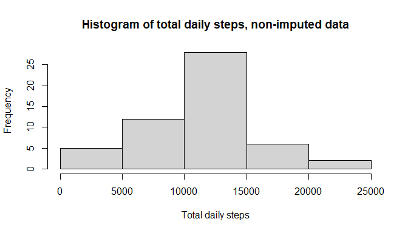
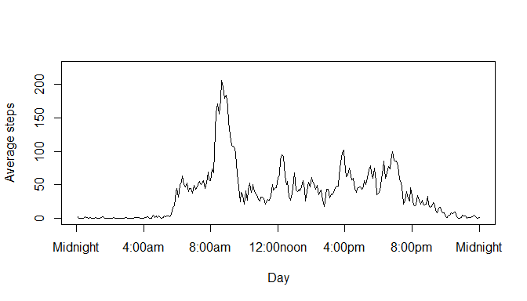
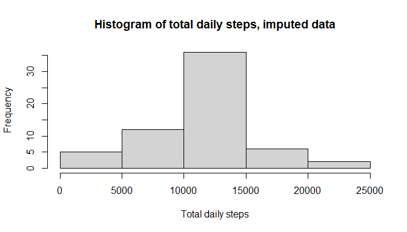
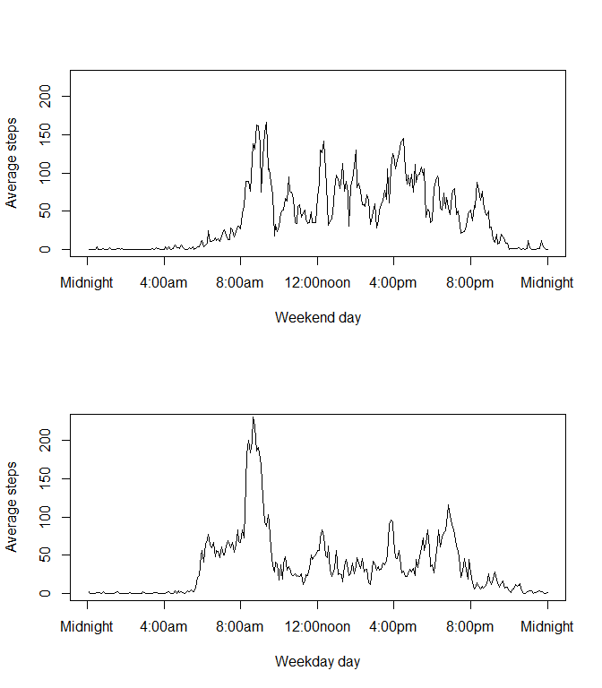

## Introduction

In this project I analyze data from a personal activity monitoring device.  The device collected the number of steps taken by one individual.  The number of steps is recorded every 5 minutes.  The data covers two months, October and November, of 2012.  

The code and documentation were created as the Week 2, Course Project 1 of the Reproducible Research course in Coursera.  

## 1. Load data and libraries


```r
# read in the data file
activity = read.csv("activity.csv")

# required libraries
library(dplyr) # to filter data by weekday and impute the data
```

## 2 and 3.  Total steps each day, non-imputed data

A histogram is created showing the total number of steps taken each day.  The mean and median number of steps each day is found. 


```r
# Plot the histogram
hist(tapply(activity$steps, activity$date, FUN = sum),
     xlab = "Total daily steps",
     main = "Histogram of total daily steps, non-imputed data")
```

<!-- -->

```r
# Find the mean and median using summary
steps_summary = summary(tapply(activity$steps, activity$date, FUN = sum))
```

The mean number of steps each day is 1.0766189\times 10^{4} and the median number of steps each day is 1.0765\times 10^{4}.

## 4 and 5.  Average steps in 5 minutes

Compute the number of steps taken in a 5-minute period during each day, averaged over all the days.  Plot the resulting averages over time. 

Also, find the 5-minute interval that has the the maximum number of steps, on average across the days. (Which time of the day is the individual most active?)


```r
# Plot the steps in each 5-minute period averaged over each day
ticks_at = c(0, 48, 96, 144, 192, 240, 288)
tick_labs = c("Midnight","4:00am", "8:00am", "12:00noon", "4:00pm", "8:00pm", "Midnight")

plot(tapply(activity$steps, activity$interval, FUN = mean, na.rm = TRUE), 
     type = "l",
     xlab = "Day",
     ylab = "Average steps",
     ylim = c(0,225),
     xaxt = "n")
axis(side = 1, at = ticks_at, labels = tick_labs)
```

<!-- -->


```r
# Compute the time of day with the maximum number of steps on average
max_interval = which.max(tapply(activity$steps, activity$interval, FUN = mean, na.rm = TRUE))
max_minutes = max_interval * 5
max_hour = floor(max_minutes / 60)
max_minute = max_minutes - floor(max_minutes / 60) * 60
```

On average, during the day, the individual takes the most steps during interval numbered 104.  This is the 5-minute interval beginning at 8:40 AM.  

## 6. Impute missing values 

Determine the number of missing values among the variable 'steps'.  Also, impute the missing values into a new data set.  


```r
# Compute the number of NA values in 'steps' using summary
na_summary = summary(activity$steps)
total_measurements = nrow(activity)
```
The total number of missing data values in the variable 'steps' is 2304 out of a total of 17568 measurements.   


```r
# Impute the NA 'steps' values using the mean by time interval
activity_imputed = activity %>% group_by(interval) %>% mutate(steps = ifelse(is.na(steps), mean(steps,na.rm = TRUE),steps))
```

The missing 'steps' values are imputed as the mean of the number of steps taken by the individual during each time interval.  This imputation assumes that the individual has about the same activity level during each time of the day.  

## 7. Total steps each day, imputed data

A histogram is created showing the total number of steps taken each day, using the imputed data.  The mean and median number of steps each day is found. 


```r
# Plot the histogram
hist(tapply(activity_imputed$steps, activity_imputed$date, FUN = sum),
     xlab = "Total daily steps",
     main = "Histogram of total daily steps, imputed data")
```

<!-- -->


```r
# Find the mean and median using summary
steps_summary_imp = summary(tapply(activity_imputed$steps, activity_imputed$date, FUN = sum))
```

After imputation, the mean number of steps each day is 1.0766189\times 10^{4} and the median number of steps each day is 1.0766189\times 10^{4}.

## 8. Weekday and weekend comparison

Use dplyr to filter the data into two sets, one each for weekdays and weekends.  Then create a panel plot comparing the average number of steps taken per 5-minute interval by weekday and weekend.  


```r
# Create the weekend and weekday data sets
activity_imputed$day_name = weekdays(as.Date(activity_imputed$date))
weekend_days = c("Saturday","Sunday")

activity_imputed$day_type = rep("weekday",total_measurements)

for (i in 1:total_measurements){
activity_imputed$day_type[activity_imputed$day_name %in% weekend_days] = "weekend"
}

weekend_activity = activity_imputed %>% filter(day_type == "weekend")
weekday_activity = activity_imputed %>% filter(!(day_type == "weekend"))
```


```r
# Plot the weekend and weekday data
par(mfrow = c(2,1))
plot(tapply(weekend_activity$steps, weekend_activity$interval, FUN = mean), 
     type = "l",
     xlab = "Weekend day",
     ylab = "Average steps",
     ylim = c(0,225),
     xaxt = "n")
axis(side = 1, at = ticks_at, labels = tick_labs)
plot(tapply(weekday_activity$steps, weekday_activity$interval, FUN = mean), 
     type = "l",
     xlab = "Weekday day",
     ylab = "Average steps",
     ylim = c(0,225),
     xaxt = "n")
axis(side = 1, at = ticks_at, labels = tick_labs)
```

<!-- -->


